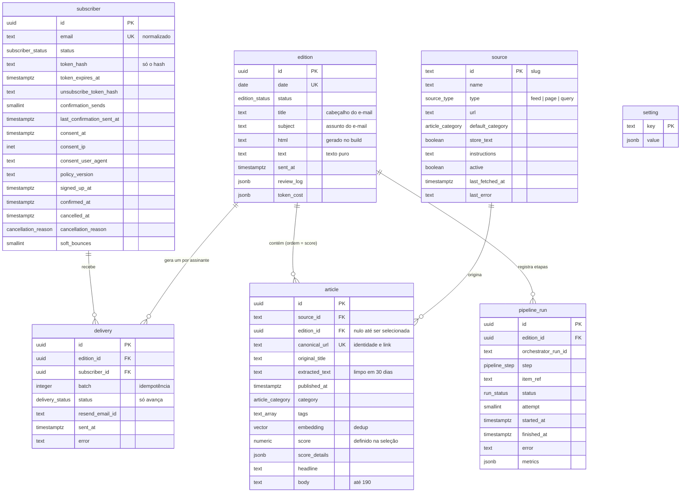

# Revisão da arquitetura — newsletter Argon

Revisão dos diagramas (cadastro, pipeline, banco, stack) cruzada com o repositório e as
decisões do time. 2026-09-15. Esquema em [`esquema.sql`](esquema.sql).

Estado do código: Next.js 16, cadastro simulado (REB-74/75), confirmação e preview prontos.

## 1. Decisões

| Tema | Decisão |
| --- | --- |
| Cadência | Seg a sáb, 7h (America/Sao_Paulo), janela de ±59 min aceita. Segunda cobre 48h. |
| Edição | 4 a 6 notícias por score. Mínimo 3 com alerta; abaixo, pula o dia e alerta. |
| Idioma | Português. |
| Confirmação | Link de 48h, uso único. Pendentes expirados apagados por job diário. |
| Formulário | Honeypot no servidor, limites por IP e por e-mail, resposta sem enumeração. |
| Descadastro | Link com token, cabeçalho RFC 8058, reclamação de spam, pedido manual. |
| Log de envio | Uma linha por assinante e edição. |
| Pipeline | AI-driven: Ingestor, Selecionador, Redator e Revisor (com visão) são agentes. Construtor HTML é template. |
| Revisão | 3 tentativas por item. Falhou: alerta por e-mail. Sem revisão humana. |
| Execução | Pipeline em `apps/api` (Next.js só com route handlers), projeto próprio na Vercel, Hobby. Vercel Workflows + agentes do Mastra. Disparo por Vercel Cron. |
| Bounce | Hard cancela; soft cancela em 3 consecutivos; reclamação nunca reenvia. |
| Stack | Resend, Supabase, Vercel, Mastra. Modelos: Claude, via créditos de sessão do Claude Code (ARG-93). |
| Aberto | Horário de geração (medir), política de privacidade, "Acessar plataforma", pixel de abertura. |

## 2. Cadastro

**Token.** 32 bytes aleatórios no link; no banco só o hash SHA-256 e a expiração. Confirmar
apaga o hash. Reenvio invalida o anterior. A tela de link expirado oferece reenviar.

**Anti-abuso.** O formulário dispara e-mail para qualquer endereço digitado. Ordem no
servidor, antes de banco ou Resend:

1. Honeypot preenchido: responde sucesso e descarta.
2. Valida e normaliza o e-mail (`lib/email.ts`).
3. Limite por IP: 5/h no Firewall da Vercel. Por e-mail: 1 reenvio a cada 5 min, 3/dia
   (`last_confirmation_sent_at`, `confirmation_sends`, zerado por job).
4. Consentimento marcado e versão da política registrada.
5. Ação por status:

| Status | Ação |
| --- | --- |
| inexistente | cria `pending`, envia confirmação |
| `pending` | token novo, reenvia |
| `confirmed` | e-mail "já inscrito" com link de descadastro |
| `cancelled` | volta a `pending`, envia confirmação (novo consentimento) |
| `bounced` | volta a `pending` e tenta; novo bounce mantém |

Resposta ao cliente sempre igual: "enviamos um link para X". Rotas em `apps/api`; a regra
fica em `apps/api/src/newsletter`, testável sem HTTP. O site só tem as páginas e faz POST.

**Descadastro.** Quatro entradas, mesmo efeito (`cancelled`, `cancelled_at`,
`cancellation_reason`):

1. Link no rodapé com `unsubscribe_token` permanente. Um clique cancela; página oferece
   reativar, que exige nova confirmação.
2. `List-Unsubscribe` e `List-Unsubscribe-Post` (RFC 8058). Gmail e Yahoo exigem.
3. Webhook `email.complained`: motivo `complaint`, nunca reenviar.
4. Pedido manual ao encarregado.

Página `/newsletter/unsubscribe`, tela cheia, como a confirmação. Registro fica 6 meses como
prova e é apagado por `pg_cron`.

## 3. Pipeline

Regra: I/O e regras duras em ferramentas e validadores; o agente decide sobre elas.

**Ingestor (agente).** Ferramentas: `list_sources`, `read_feed`, `read_page` (só domínio da
fonte, `robots.txt`, timeout 10s), `query` (fonte tipo `query`, ex.: SELIC no SGS),
`save_article` (upsert por URL canônica). Em código: janela 24h/48h, tamanho máximo do
texto, não guardar texto de paywall (Gartner, Zero Hora). SELIC: compara com a última notícia
da fonte e só cria outra se mudou.

**Selecionador (agente).** Dedup antes do agente: URL canônica e embedding (`pgvector`),
inclusive contra edições anteriores. Score com rubrica estruturada (impacto, atualidade,
fonte, 0 a 5) e justificativa, gravados em `article`. Score define a ordem e não é
recalculado. Regra de mínimo em código.

**Redator (agente).** Por item: `headline` e `body` (≤ 190). Link é a URL canônica. Para a
edição: `title` (cabeçalho) e `subject` (≤ 78). Validação em código; estourou, reescreve o
item. Só fatos do texto extraído.

**Construtor (template).** `apps/api/src/email`, sem LLM: tabelas, CSS inline, 600px,
modo escuro, rodapé fixo com descadastro e remetente, texto puro, < 100 KB. HTML e texto
puro ficam gravados em `edition`: arquivo no site e reenvios só leem, sem regenerar. Falha
na validação é bug do template: alerta, não retenta.

**Revisor (agente, com visão).** Sintático em código (validações acima, links 200).
Semântico: fidelidade à fonte, tom, português, repetição, assunto condizente. Visual:
captura a 600 e 375 px para modelo com visão; foca no que varia por edição (manchete
quebrando mal, corpo estourando, ordem coerente). Playwright não cabe na Vercel: serviço de
captura por API ou Vercel Sandbox. Capturas não são persistidas; vão no alerta. Teste manual
em Gmail, Outlook e Apple Mail uma vez por versão do template.

Loop de 3 tentativas por item; item que falha é descartado e a regra de mínimo decide. Kill
switch em `setting.sending_paused`, checado antes de enviar.

**Distribuidor (código).** Lê `confirmed`, cria `delivery`, envia em lotes de 100 com chave
de idempotência `edition_id:batch`, grava `resend_email_id`.

## 4. Execução na Vercel

O que a documentação confirma:

- Mastra em Next.js: `serverExternalPackages: ['@mastra/*']`; storage em Postgres
  (`@mastra/pg`), não LibSQL.
- O scheduler nativo do Mastra é um `setInterval`; em FaaS não recebe o segundo tick.
  Declarar `schedule` num workflow troca o motor para "evented", que trava em serverless
  (issue #18807, aberta). Workers do Mastra exigem processo persistente.
- Motor padrão: `run.start()` roda tudo na mesma invocação.
- Vercel Hobby: função de 300s; cron uma vez por dia, precisão ±59 min. Pro: 800s, por
  minuto.
- Vercel Workflows: `'use workflow'` / `'use step'`, cada step uma invocação com retry, run
  sem limite de duração, step limitado a `maxDuration`. Hobby inclui 50 mil eventos/mês.

**Decisão: Vercel Workflows orquestrando agentes do Mastra, em `apps/api`.** Sem fornecedor
extra; o Mastra fica em agentes, ferramentas e troca de modelo. Alternativa se o SDK
decepcionar: Mastra + Inngest. Motor padrão do Mastra só para medir em desenvolvimento.

**Cron.** Vercel Cron com a janela de uma hora aceita. Consequências: o critério de aceite
passa a ser "entre 7h e 8h"; a etapa `deliver` só envia edição com status `ready`, senão
alerta. `pg_cron` com `pg_net` é a saída se a janela deixar de caber. Cron em UTC:
`0 8 * * 1-6` gera, `0 10 * * 1-6` envia.

**Etapas**, cada uma idempotente e registrada em `pipeline_run`:

| Etapa | Granularidade |
| --- | --- |
| `ingest` | por fonte, em paralelo |
| `select` | edição |
| `write` | por item, em paralelo |
| `build` | edição, milissegundos |
| `review` | edição, inclui captura |
| `deliver` | por lote de 100 |

**Storage do Mastra.** `@mastra/pg` no Supabase, conexão pooled (porta 6543),
`attachDatabasePool`, schema `mastra`.

**Monorepo.** Pacote só onde há dois consumidores: `db`, usado por `web` e `api`. O resto
são pastas dentro de `apps/api`; viram pacote se um segundo app passar a importar.

```
apps/
├── web/src/app/
│   ├── (site)/editions/[date]/          # arquivo: lê edition.html
│   └── newsletter/                      # formulário, confirmed, expired, unsubscribe
└── api/                                 # Next.js só com rotas, projeto próprio na Vercel
    ├── next.config.ts                   # withWorkflow(), serverExternalPackages @mastra/*
    ├── vercel.json                      # crons: generate 0 8 * * 1-6, deliver 0 10 * * 1-6
    └── src/
        ├── app/api/
        │   ├── cron/{generate,deliver}/ # confere CRON_SECRET, start(workflow)
        │   ├── webhooks/resend/         # bounce, complaint, delivered → delivery.status
        │   └── newsletter/{subscribe,confirm,unsubscribe}/
        ├── workflows/
        │   ├── generate-edition.ts      # "use workflow": ingest → select → write → build → review
        │   ├── deliver-edition.ts       # checa ready e kill switch → lotes de 100
        │   └── steps/                   # um "use step" por etapa; cada um chama um agente
        ├── pipeline/                    # Mastra
        │   ├── mastra.ts                # new Mastra({ storage: PostgresStore })
        │   ├── models.ts                # modelo por agente, via env
        │   ├── agents/                  # ingestor, selector, writer, reviewer
        │   ├── tools/                   # list-sources, read-feed, read-page, query-source, save-article, dedup, screenshot
        │   ├── prompts/
        │   └── schemas/                 # zod: saída estruturada
        ├── newsletter/                  # subscribe, confirm, unsubscribe, tokens, limits
        ├── email/                       # templates (edition, confirm, already-subscribed), render, validate
        └── lib/                         # auth (cron, Resend), alerts, runs (pipeline_run)
packages/
└── db/                                  # migrations/0001_initial.sql (= esquema.sql), schema.ts (Drizzle), client.ts
```

`apps/api` é Next.js porque o Workflow SDK tem integração de primeira classe nele; o
servidor standalone do Mastra exigiria expor as rotas do SDK à mão. As rotas geradas em
`.well-known/workflow/` não são commitadas e entram nos `outputs` do `turbo.json`.

## 5. Modelo de dados

Sete tabelas em 3FN, identificadores em inglês. Detalhe em [`esquema.sql`](esquema.sql).

**Mudanças em relação ao diagrama.**

| Diagrama | Esquema | Motivo |
| --- | --- | --- |
| `consentimento (boolean)` | `consent_at`, `consent_ip`, `consent_user_agent`, `policy_version` | prova de consentimento |
| sem token | `token_hash`, `token_expires_at`, `unsubscribe_token_hash` | §2 |
| sem cancelamento | `cancellation_reason`, `cancelled_at`, `soft_bounces` | descadastro e bounce |
| `Edicao.noticias[]` | `article.edition_id` (1:N) | dedup garante uma edição por notícia; ordem é o score |
| `Edicao.html_edicao` | `html`, `text` | gravados na etapa `build`; arquivo e reenvio só leem |
| `numero_assinantes` | removido | `count(*)` em `delivery` |
| — | `edition.title`, `edition.subject` | não existiam no diagrama |
| — | `delivery` | idempotência e bounce |
| — | `pipeline_run` | estado, medição, alerta |
| — | `source` | fontes do Ingestor; SELIC é tipo `query` |
| — | `setting` | kill switch e parâmetros |

**Removidos na simplificação:** tabelas de evento de cadastro (limite por IP vai ao
Firewall), de evento do Resend (`delivery.status` só avança, webhook idempotente), de
indicador (SELIC é fonte) e a junção edição–notícia; campos derivados
(`subscriber_count`, `attempts`, `link`, `original_url`, `content_hash`, `domains`).

**Normalização.** 1FN: arrays e jsonb que ficaram são folhas gravadas e lidas inteiras
(`tags`, `setting.value`, `score_details`, `review_log`, `token_cost`, `metrics`); se
passarem a ser filtrados, viram tabela. 2FN: chaves simples; a única composta é a unique de
`delivery`, sem dependência parcial. 3FN: derivados removidos; `subscriber.status` fica
porque bounce e reclamação não têm data própria.



Regras: migrations versionadas; acesso só pela chave de serviço, RLS ligado sem políticas;
`extracted_text` limpo em 30 dias.

## 6. Envio

**`delivery`.** Criada antes de chamar o Resend; lote só inclui `pending`, reexecução não
reenvia. `resend_email_id` liga o webhook ao assinante. Chave de idempotência do Resend por
lote.

**Bounce.**

| Evento | Ação |
| --- | --- |
| hard bounce | `bounced` |
| soft bounce | `soft_bounces + 1`; 3 consecutivos viram `bounced` |
| `email.complained` | `cancelled`, motivo `complaint` |
| `email.delivered` | zera `soft_bounces` |

**Entregabilidade.** Subdomínio dedicado (`news.`) com SPF, DKIM e DMARC
(`p=quarantine`). Aquecimento gradual no lançamento. Texto puro, sem encurtador, poucas
imagens. Monitorar bounce < 2% e reclamação < 0,1%. Resend gratuito: 100 e-mails/dia; acima
disso, plano pago no lançamento.

## 7. LGPD

1. Política de privacidade antes de coletar. Hoje é placeholder.
2. Consentimento registrado: data, IP, user agent, versão da política.
3. Revogação tão fácil quanto a concessão (§2).
4. Retenção: pendentes 48h, cancelados 6 meses, texto extraído 30 dias.
5. Canal do encarregado na política; acesso e exclusão em até 15 dias.
6. Resend, Supabase e Vercel fora do Brasil: região `sa-east-1` onde houver, DPA assinado,
   operadores citados na política.
7. Pixel de abertura desligado por padrão; clique só com uso claro e citado na política.

## 8. Stack

- **Resend.** API de lote com cabeçalhos de descadastro próprios.
- **Supabase.** Postgres, `pgvector`, `pg_cron`, região São Paulo. Sem Auth por enquanto.
- **Vercel.** Hobby enquanto for só a newsletter. Migra para Pro se: uso comercial (termos
  do Hobby), step acima de 300s, ou a janela do cron deixar de caber.
- **Mastra.** Agentes e ferramentas. Sem scheduler nem workers na Vercel.

## 9. Próximos passos

1. **Rodar um pipeline Mastra mínimo**: ingerir uma notícia, escrever, passar pelo
   Construtor HTML e ter um e-mail pronto para envio, sem a integração de envio. É o core
   da aplicação. Quando rodar, expandir ao redor.
2. **Decidir como usar créditos de sessão do Claude Code** para consumir os modelos, junto
   com o item 1 (ARG-93). Localmente pela ferramenta CLI; em produção, chave de API.
3. **Seguir conforme a necessidade surgir**, completando cada uma das histórias.

## Fontes

Mastra: guia Next.js, deploy em web framework, *Scheduled workflows*, *Workers*, guia
Inngest, *Storage*. GitHub mastra-ai/mastra #18807. Vercel: *Functions limits*, *Cron
usage*, *Workflows*, *Workflow concepts*, *Workflow pricing*. Resend: *Batch emails*,
*Pricing*.
